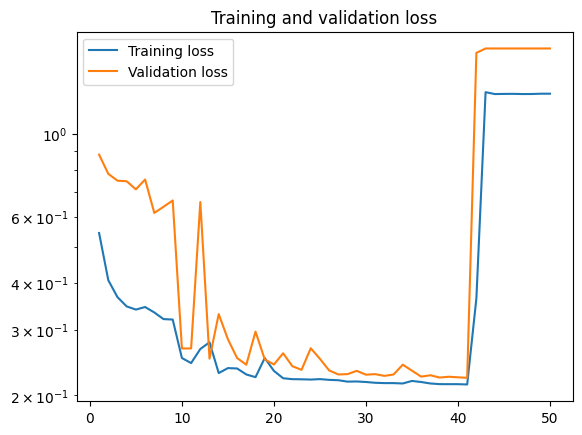
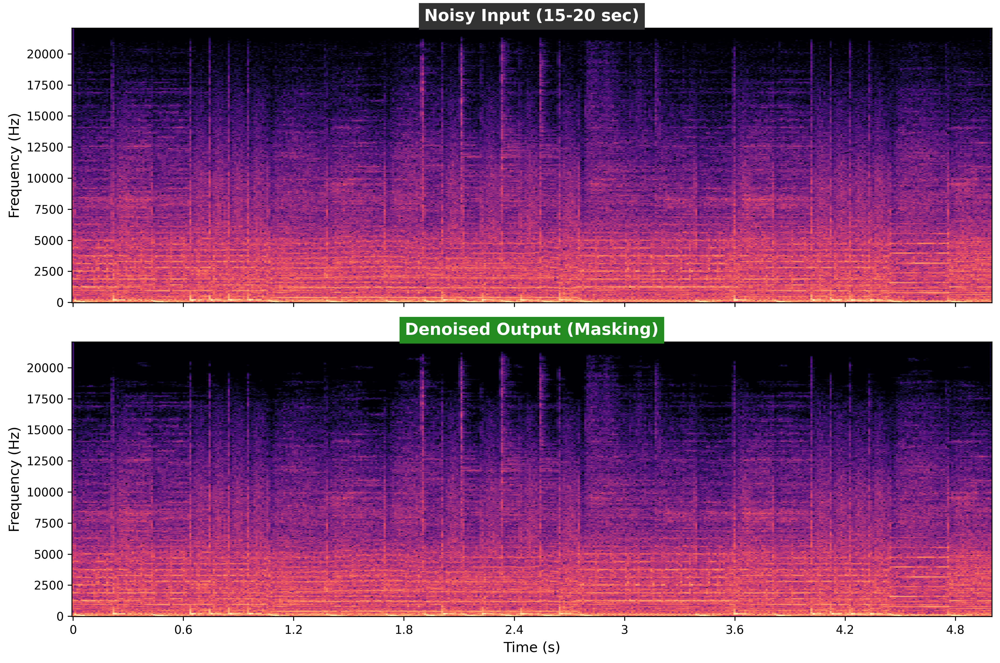

# Cassette denoising

This project is based on [Speech-enhancement with Deep learning](https://github.com/vbelz/Speech-enhancement) by Vincent Belz. Thank you, Vincent

## Introduction
**This project aims at building a audio enhancement system to elimitate cassette noise.**

Audios have many different ways to be represented, going from raw time series to time-frequency decompositions.
The choice of the representation is crucial for the performance of your system.
Among time-frequency decompositions, Spectrograms have been proved to be a useful representation for audio processing. They consist in 2D images representing sequences of Short Time Fourier Transform (STFT) with time and frequency as axes, and brightness representing the strength of a frequency component at each time frame. In such they appear a natural domain to apply the CNNS architectures for images directly to sound. Between magnitude and phase spectrograms, magnitude spectrograms contain most the structure of the signal. Phase spectrograms appear to show only little temporal and spectral regularities.

In this project, I will use magnitude spectrograms as a representation of sound (cf image below) in order to predict the noise model to be subtracted to a noisy voice spectrogram.


## Prepare the data

To create the datasets for training, I gathered digitized a few audiocassettes I own and digitized pure cassette noise from an empty cassette. I applied noise reduction to the audio in [Audacity](https://www.audacityteam.org/) to make them sound clean enough and then added the recorded cassette noise on top. I did so for two reasons: 
    - if I would pair raw cassette recordings with Audacity-denoised versions there would be a difference in dB, which I didn't want.
    - it proved impossible to pair them with digitazation of the same cassettes with Dolby B noise reduction turned on, due to wow and flutter it wasn't possible pair the audio 1 to 1, there was a small difference in speed playback in each moment of time, unnoticeable during regular listening, but this would be useless for the training.

To create the datasets for training/testing, audios were sampled at 44.1kHz. I added together two music albums with small pauses in betweem resulting in around 2 hours of continious audio. To train the model 'notebook.ipynb' was used.

## Training

The model used for the training is a U-Net, a Deep Convolutional Autoencoder with symmetric skip connections. [U-Net](https://arxiv.org/abs/1505.04597) was initially developed for Bio Medical Image Segmentation. Here the U-Net has been adapted to denoise spectrograms.

As input to the U-Net use the magnitude spectrograms of the noisy audio, pipeline is made so that `.wav` audio files are transformed into spectrograms, you are expected to provide only the `.wav` files. Model outputs a mask, which applied to the audio denoises it.

The final configuration of the model is the following: a U-Net with 10 convolutional layers arranged in 5 levels of depth, each with LeakyReLU activation, He normal weight initialization and Max Pooling for downsampling. The model uses Sigmoid activation in the final layer to predict the mask with values 0 to 1, which represent probability of being noise or actual signal.

Model is compiled with Adam optimizer and a custom loss function, specifically made for the expected amplitude of the cassette noise.

Training was conducted in Google Colab so I don't know how long that would take on a PC, but a powerfull videocard is adviced. NVIDIA cards sure work, because the support CUDA, AMD should work too with [Tensorflow-directml](https://pypi.org/project/tensorflow-directml/).

I managed to obtain a training loss of 0.2134 (mae=0.0585) and a validation loss of 0.2229 (mae=0.0585). Below a loss graph made for the final training (you can see that in the end it flatlined, but the one with the best results was used either way).



## Prediction

For prediction, the noisy audios are converted into time-frequency representatin with STFT, converted to dB and scaled between -1 and 1 for the input. Then it is sliced into overlapping windows of size 512x512, which is around 6 seconds of audio (44.1kHz). The model predicts the mask which is applied as the following

    $$Magnitude_{clean} = Magnitude_{noisy} \times Mask_{predicted}$$

this is for the audio not to clip and distort. At the end the cleaned magnitude is combined with original noisy phase and converted back with iSTFT. This happens twice if the audio was stereo, in this case both channels are combined at the end.

## Performance
Model has performed quite good! See (and hear) for yourself!



I have several audio files saved in `cassette_denoise/data/`.
In general, model has proven to be strong in mono and stereo denoising, it has high fidelity recovery. In the tests SI-SDR was around 19 dB. This means that the audio preserves the ingegrity of the original waveform. At the same time, it has high spectral accuracy, LSD was around 6 dB, that means that the model sucessfully differentiates between the cassette noise and the music. And finally the audio is very clean, segmental SNR of 19+ dB means that the noise reduction is consistent, cassette noise is dropped to almost complete silence, while the music is untouched.

Enjoy!

## How to use?

```
- Clone this repository
- pip install -r requirements.txt
- Use denoise_512.ipynb for denoising. By default the files are taken from "cassette_denoise/data/"
```

## References

>Jansson, Andreas, Eric J. Humphrey, Nicola Montecchio, Rachel M. Bittner, Aparna Kumar and Tillman Weyde.**Singing Voice Separation with Deep U-Net Convolutional Networks.** *ISMIR* (2017).
>
>[https://ejhumphrey.com/assets/pdf/jansson2017singing.pdf]

>Grais, Emad M. and Plumbley, Mark D., **Single Channel Audio Source Separation using Convolutional Denoising Autoencoders** (2017).
>
>[https://arxiv.org/abs/1703.08019]

>Ronneberger O., Fischer P., Brox T. (2015) **U-Net: Convolutional Networks for Biomedical Image Segmentation**. In: Navab N., Hornegger J., Wells W., Frangi A. (eds) *Medical Image Computing and Computer-Assisted Intervention – MICCAI 2015*. MICCAI 2015. Lecture Notes in Computer Science, vol 9351. Springer, Cham
>
>[https://arxiv.org/abs/1505.04597]

> K. J. Piczak. **ESC: Dataset for Environmental Sound Classification**. *Proceedings of the 23rd Annual ACM Conference on Multimedia*, Brisbane, Australia, 2015.
>
> [DOI: http://dx.doi.org/10.1145/2733373.2806390]
